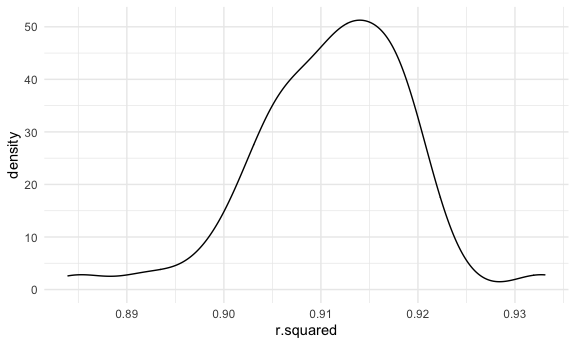

Homework 6 Solutions
================
Laura Gomez

# Problem 2

Import and tidy the following data set:

``` r
Birth_weight_df = read_csv("./Data/birthweight (1).csv") %>%
  mutate(babysex = as.character(babysex), babysex = case_when(babysex == 1 ~ "male", babysex == 2 ~ "female" )) %>%
  mutate(frace = as.character(frace),
    frace = case_when(
      frace == 1 ~ "White", 
      frace == 2 ~ "Black", 
      frace == 3 ~ "Asian",
      frace == 4 ~ "Puerto Rican",
      frace == 8 ~ "Other",
      frace == 9 ~ "Unknown"
      )) %>%
  mutate( malform = as.character(malform), malform = case_when(malform == 0 ~ "absent", malform == 1 ~ "present" ))  %>%
  mutate( mrace = as.character(mrace), 
          mrace = case_when(
            mrace == 1 ~ "White", 
            mrace == 2 ~ "Black",
            mrace == 3 ~ "Asian",
            mrace == 4 ~ "Puerto Rican",
            mrace == 8 ~ "Other"
            ))
```

    ## Parsed with column specification:
    ## cols(
    ##   .default = col_double()
    ## )

    ## See spec(...) for full column specifications.

``` r
# Check for missing values?? ~drop_any
```

``` r
model_1fit = lm(bwt ~ gaweeks, data = Birth_weight_df)
```

``` r
Residual_predictions = Birth_weight_df %>% 
  modelr::add_residuals(model_1fit) %>% 
  modelr::add_predictions(model_1fit) %>%
  select(resid,pred)

  
Plot = Residual_predictions %>% ggplot(aes(x = resid, y = pred)) + 
  geom_point()
Plot
```


``` r
#X is residuals, y predictions ---> check plot 
```

Compare your model to two others:

\-One using length at birth and gestational age as predictors (main
effects only)

``` r
model_2fit = lm(bwt ~ blength + gaweeks, data = Birth_weight_df)
#compare cross validation, graph
```

\-One using head circumference, length, sex, and all interactions
(including the three-way interaction) between these

``` r
model_3fit = lm(bwt ~ bhead * blength * babysex, data = Birth_weight_df) 

cv_df = 
  crossv_mc(Birth_weight_df, 100) 

cv_df = 
  cv_df %>% 
  mutate(
   model_3fit  = map(train, ~lm(bwt ~ bhead * blength * babysex, data = Birth_weight_df)), 
   model_2fit = map(train, ~lm(bwt ~ blength + gaweeks, data = Birth_weight_df)),
   model_1fit = map(train, ~lm(bwt ~ gaweeks, data = Birth_weight_df))) %>%
  mutate(
    rmse_3fit = map2_dbl(model_3fit, test, ~rmse(model = .x, data = .y)),
    rmse_2fit = map2_dbl(model_2fit, test, ~rmse(model = .x, data = .y)),
    rmse_1fitl = map2_dbl(model_1fit, test, ~rmse(model = .x, data = .y)))

Compare_model_Plot = cv_df %>% 
  select(starts_with("rmse")) %>% 
  pivot_longer(
    everything(),
    names_to = "model", 
    values_to = "rmse",
    names_prefix = "rmse_") %>% 
  mutate(model = fct_inorder(model)) %>% 
  ggplot(aes(x = model, y = rmse)) + geom_violin()
Compare_model_Plot
```


\#\#Problem 3

Import Data

``` r
weather_df = 
  rnoaa::meteo_pull_monitors(
    c("USW00094728"),
    var = c("PRCP", "TMIN", "TMAX"), 
    date_min = "2017-01-01",
    date_max = "2017-12-31") %>%
  mutate(
    name = recode(id, USW00094728 = "CentralPark_NY"),
    tmin = tmin / 10,
    tmax = tmax / 10) %>%
  select(name, id, everything())
```

    ## Registered S3 method overwritten by 'hoardr':
    ##   method           from
    ##   print.cache_info httr

    ## using cached file: /Users/lauragomez1/Library/Caches/R/noaa_ghcnd/USW00094728.dly

    ## date created (size, mb): 2020-12-07 19:33:55 (7.536)

    ## file min/max dates: 1869-01-01 / 2020-12-31

Use 5000 bootstrap samples and, for each bootstrap sample, produce
estimates of these two quantities. Plot the distribution of your
estimates, and describe these in words.

``` r
boot_sample = function(df) {
  sample_frac(df, replace = TRUE)
}

boot_straps = 
  tibble(
    strap_number = 1:100,
    strap_sample = rerun(100, boot_sample(weather_df))
  )

# Plot 1

beta_results = 
  boot_straps %>%
  mutate(
      models =  map(.x = strap_sample, ~lm(tmax ~ tmin, data = .x)),
      results2 = map(models, broom::tidy)) %>%
  select(strap_number, results2) %>%
  unnest(results2) 

beta_results_plot = beta_results %>%
  ggplot(aes( x = estimate)) + geom_density()
beta_results_plot
```


``` r
#Plot 2

rsquared_results = 
   boot_straps %>%
  mutate(
      models =  map(.x = strap_sample, ~lm(tmax ~ tmin, data = .x)),
      results = map(models, broom::glance)) %>%
  select(strap_number, results) %>%
  unnest(results) 

rsquared_results_plot = rsquared_results %>%
  ggplot(aes( x = r.squared)) + geom_density()
rsquared_results_plot
```



\#Confidence Intervals: Identify the 2.5% and 97.5% quantiles to provide
a 95% confidence interval for r̂ 2 and log(β̂ 0∗β̂ 1).

``` r
betas = beta_results %>% select(estimate, strap_number, term)  %>%
  pivot_wider(names_from = term, values_from = estimate)

Conf_Intervals = left_join(betas, rsquared_results, by = "strap_number") %>%
   select(r.squared,`(Intercept)`,tmin, strap_number) %>%
  mutate( beta = log(.[2] * tmin)) 

#95%  for r̂ 2
    ci_lower = quantile(Conf_Intervals$r.squared, 0.025)
    ci_upper = quantile(Conf_Intervals$r.squared, 0.975)
    
#95% for log(β̂ 0∗β̂ 1)

beta_ci_lower = quantile(Conf_Intervals$beta$`(Intercept)`, 0.025)
beta_ci_upper = quantile(Conf_Intervals$beta$`(Intercept)`, 0.975)
```
